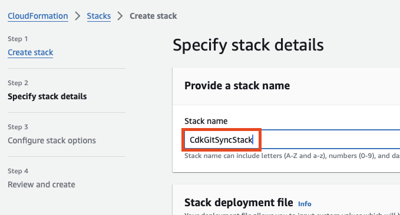

# AWS CDK Git Sync Sample


## Note

To obtain accurate results from cdk diff, it's necessary to align the CloudFormation stack name with CDK in the AWS Management Console.

In the implementation example, the stack name is `CdkGitSyncStack`.

```typescript
new CdkGitSyncStack(app, 'CdkGitSyncStack', {
  stackName: 'CdkGitSyncStack'. // Stack name
});
```


